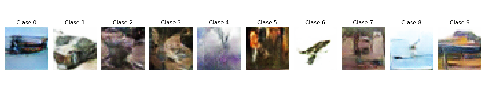
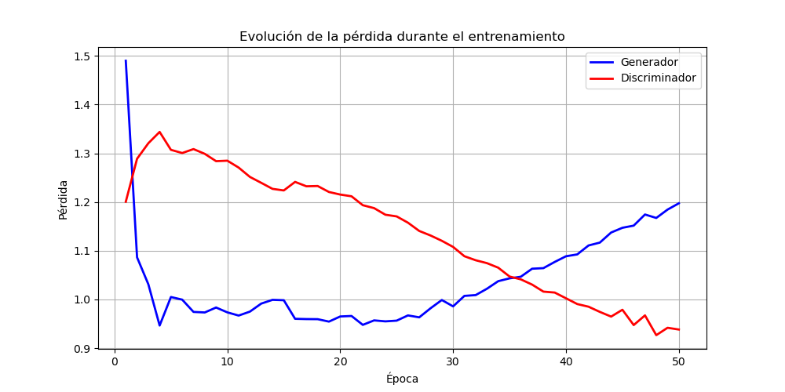

# Conditional GAN (cGAN) con PyTorch para CIFAR-10
Este repositorio contiene la implementación desde cero de una **Red Generativa Adversaria Condicional (cGAN)** construida con PyTorch. El objetivo del modelo es generar imágenes a color de 32x32 píxeles condicionadas a una clase específica de las disponibles para el conjunto de datos **CIFAR-10**.

## 🧠 ¿Qué es una cGAN?

A diferencia de una GAN tradicional que genera imágenes aleatorias a partir de ruido latente, una **GAN Condicional** inyecta información semántica (etiquetas *one-hot* correspondientes a la clase) tanto en el Generador como en el Discriminador. Esto permite que el resultado pedido relativo a una de las 10 clases distintas disponibles coincida dicha clase.

## 📊 Dataset: CIFAR-10
El modelo ha sido entrenado utilizando el conjunto de datos **CIFAR-10**, que consta de:
*   60.000 imágenes a color (RGB).
*   Resolución espacial de 32x32 píxeles.
*   10 clases distintas (avión, coche, pájaro, gato, ciervo, perro, rana, caballo, barco y camión).

## 🚀 Técnicas implementadas
Para estabilizar el entrenamiento y evitar el colapso del modelo, se implementaron las siguientes técnicas:
*   **Label Smoothing:** Suavizado aleatorio de etiquetas reales (0.8 - 1.0) y falsas (0.0 - 0.1) para evitar que el discriminador gane exceso de confianza.
*   **Instance Noise:** Inyección de ruido gaussiano temporal en las entradas del discriminador para dificultar la separación inicial y aportar gradientes útiles al generador.
*   **Renovación del espacio latente:** Uso de un nuevo lote de ruido independiente en la fase de actualización del generador para fomentar la variabilidad y evitar el sobreajuste.

## 🖼️ Resultados

**Ejemplo de imagen generada por clase**



**Pérdidas del generador y del discriminador en gráfica:** Podemos observar una estabilidad notable. Observamos que las pérdidas el discriminador, descendienden muy suavemente sin colapso. Por otro lado, la pérdida del generador se mantiene estable de forma contraria. Ambas pérdidas se mantienen cercanas a 1, lo cual nos da pistas que nos encontramos frente a una GAN equilibrada.



## ⚙️ Instalación y Configuración

1. Clona este repositorio:
   ```bash
   git clone [https://github.com/TU_USUARIO/cifar10-conditional-gan.git](https://github.com/TU_USUARIO/cifar10-conditional-gan.git)
   cd cifar10-conditional-gan
